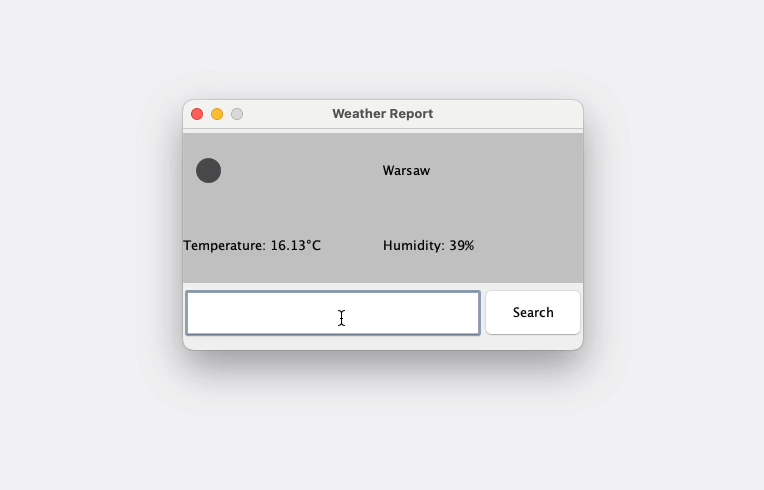

# Pogodynka



## Run Application

1. Set environment variable with the API key.

UNIX:

```shell
export WEATHER_API_KEY=YOUR_API_KEY
```

Windows:

```shell
set WEATHER_API_KEY="YOUR_API_KEY"
```

2. Create JAR.

```shell
./mvnw clean package
```

3. Run JAR.

```shell
java -jar ./target/pogodynka-1.0-SNAPSHOT-jar-with-dependencies.jar
```
