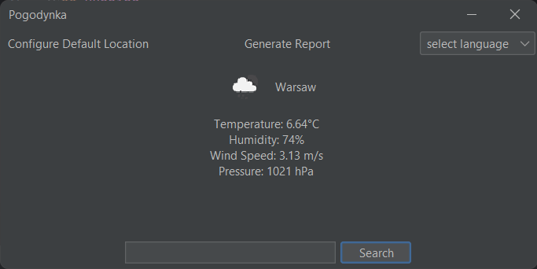

# Pogodynka



An application that provides up-to-date weather information based on the user's given location. It utilizes
the [OpenWeatherMap API](https://openweathermap.org/current) to fetch real-time weather data. Application also allows
user to generate weather reports which are saved as [PDFs](demo-report.pdf).

## Building

Pogodynka uses Maven to handle dependencies and building.

### Requirements

- [Java Development Kit 21](https://www.oracle.com/java/technologies/downloads/#jdk21) or higher
- [OpenWeather's](https://openweathermap.org) API key

#### Compile

Windows:

```shell
set WEATHER_API_KEY="YOUR_API_KEY"
./mvnw clean package
```

Unix:

```shell
export WEATHER_API_KEY=YOUR_API_KEY
./mvnw clean package
```

## Running

> [!WARNING]  
> Running application may require to set up the API key.

```shell
java -jar pogodynka-1.0.0-jar-with-dependencies.jar
```
